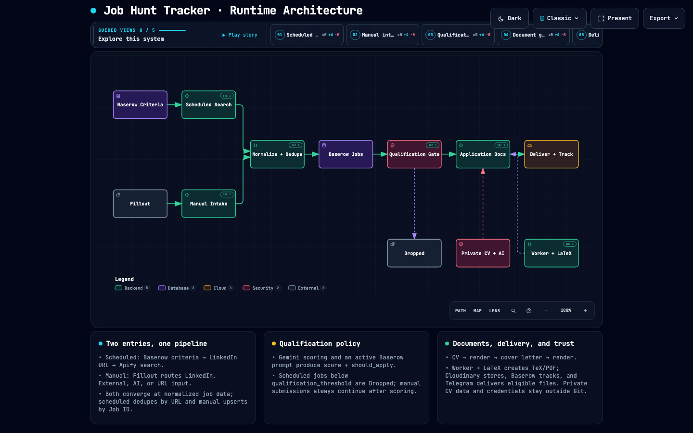
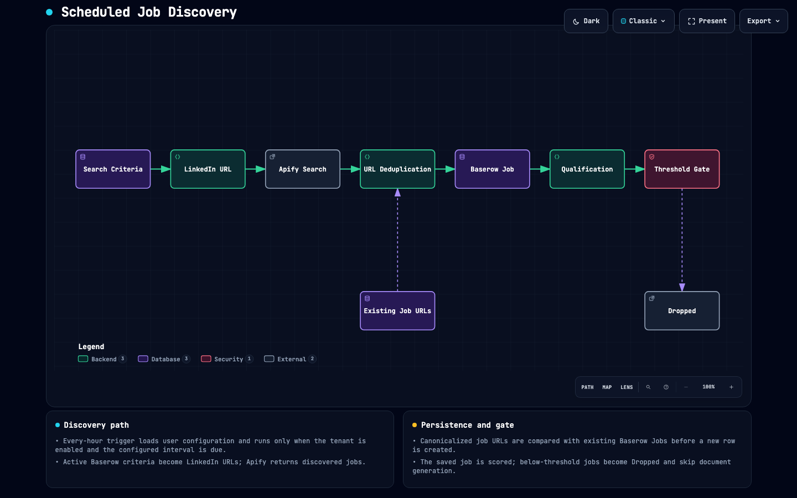
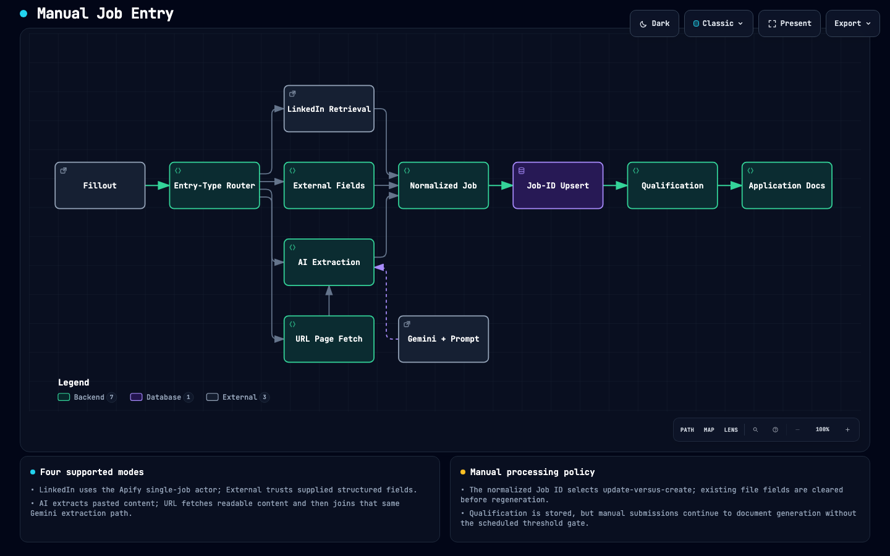
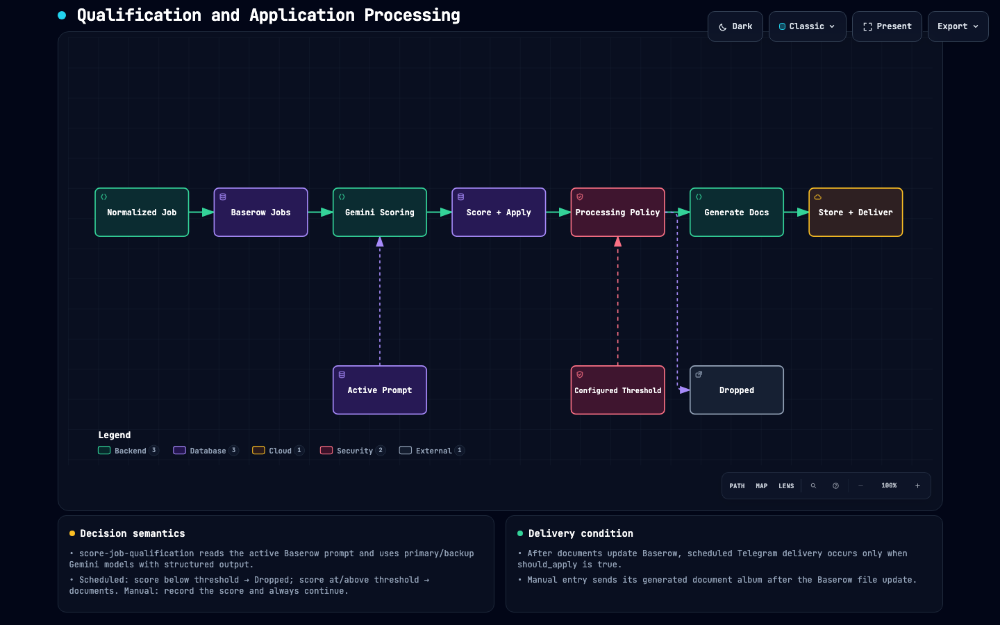
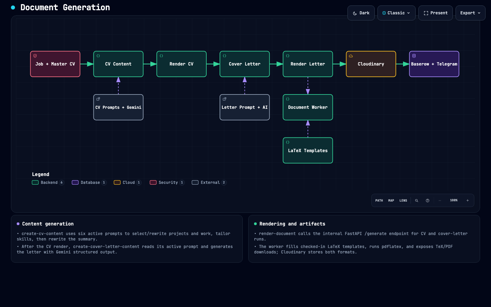
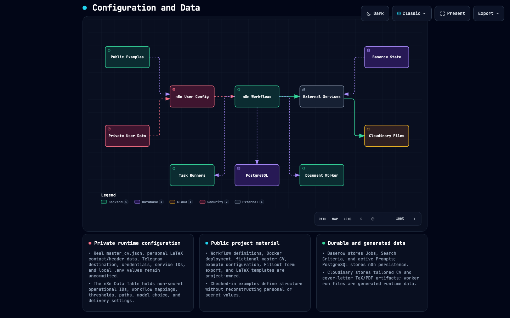

# Job Hunt Tracker

A reusable n8n workflow for discovering job postings, normalizing manual submissions, scoring fit with an LLM, tailoring application documents, rendering PDF/TeX files, and tracking the result in Baserow.

This branch is intentionally **public-safe**. Personal applicant data, Telegram destinations, credential object IDs, Baserow IDs, Fillout form IDs, workflow IDs, generated files, local `.env` values, and private CV content have been removed or replaced with examples. The checked-in master CV and LaTeX templates contain fictional placeholder data only.

## Architecture

<a href="https://roobahist.github.io/Job-Hunt-Tracker/architecture/job-hunt-tracker.html">
  
</a>

The README uses a static preview because GitHub does not run embedded HTML or JavaScript. Select the diagram to open the [interactive runtime architecture](https://roobahist.github.io/Job-Hunt-Tracker/architecture/job-hunt-tracker.html), including its guided views.

### Focused architecture views

Each preview opens its interactive diagram.

| Scheduled job discovery | Manual job entry |
| --- | --- |
| [](https://roobahist.github.io/Job-Hunt-Tracker/architecture/scheduled-job-discovery.html) | [](https://roobahist.github.io/Job-Hunt-Tracker/architecture/manual-job-entry.html) |

| Qualification and application | Document generation |
| --- | --- |
| [](https://roobahist.github.io/Job-Hunt-Tracker/architecture/qualification-and-application.html) | [](https://roobahist.github.io/Job-Hunt-Tracker/architecture/document-generation.html) |

| Configuration and data |
| --- |
| [](https://roobahist.github.io/Job-Hunt-Tracker/architecture/configuration-and-data.html) |

## Repository layout

```text
.
├── config/
│   └── n8n-user-configuration.example.csv
├── deployment/
│   ├── .env.example
│   ├── docker-compose.yml
│   └── n8n-task-runners.json
├── document-pipeline/
│   ├── master_cv.example.json
│   └── templates/
│       ├── cv_template.tex
│       └── cover_letter_template.tex
├── document-worker/
│   ├── Dockerfile
│   ├── app.py
│   ├── generate.py
│   └── requirements.txt
├── docs/
│   └── architecture/
│       ├── job-hunt-tracker.architecture.json
│       └── job-hunt-tracker.html
├── forms/
│   └── job-hunt.json
└── workflows/
    ├── create-cover-letter-content.json
    ├── create-cv-content.json
    ├── hourly-linkedin-job-hunt.json
    ├── linkedin-url.json
    ├── render-document.json
    ├── score-job-qualification.json
    └── unified-job-entry.json
```

Generated PDFs, TeX build artifacts, document-worker run directories, local secrets, and the real `master_cv.json` are deliberately excluded.

## Prerequisites

You need:

- Docker and Docker Compose
- an n8n instance with external task runners enabled
- PostgreSQL for n8n persistence
- a Baserow workspace/database
- a Fillout form
- Google Gemini credentials
- an Apify account and compatible LinkedIn actors
- a Cloudinary account
- a Telegram bot/chat if you want Telegram delivery
- a public HTTPS hostname for n8n webhooks

The deployment files in `deployment/` provide n8n, PostgreSQL, external JavaScript/Python task runners, and the document worker. A reverse proxy and TLS termination are intentionally left to the deployment environment.

## 1. Deploy n8n and the document worker

Copy the example environment file and replace every secret value:

```bash
cd deployment
cp .env.example .env
```

At minimum set:

```dotenv
DOMAIN_NAME=n8n.example.com
TIMEZONE=UTC
POSTGRES_DB=n8n
POSTGRES_USER=n8n
POSTGRES_PASSWORD=<long-random-password>
N8N_ENCRYPTION_KEY=<long-random-encryption-key>
N8N_RUNNERS_AUTH_TOKEN=<long-random-runner-token>
```

Then start the stack:

```bash
docker compose up -d --build
```

The n8n container expects the document pipeline to be mounted at:

```text
/home/node/.n8n-files/document-pipeline
```

The document worker mounts the same data at `/data/document-pipeline` and exposes an internal `/generate` API used by `render-document`.

Before starting the stack, create a local runtime directory next to `deployment/` that contains your private master CV and the checked-in templates, or adjust the compose mount to match your layout. The real master CV should be named `master_cv.json` and must never be committed.

## 2. Create your private master CV

Copy the example:

```bash
cp document-pipeline/master_cv.example.json document-pipeline/master_cv.json
```

Replace the fictional data with your own information. The workflow expects this top-level schema:

```json
{
  "summary": ["..."],
  "skills": [
    {"label": "Programming", "value": "Python, SQL"}
  ],
  "work_experience": [
    {
      "title": "...",
      "secondary": "...",
      "organization": "...",
      "date": "...",
      "content": ["...", "..."]
    }
  ],
  "projects": [],
  "awards": []
}
```

`document-pipeline/master_cv.json` is ignored by Git so your real employment history does not enter source control.

## 3. Customize the LaTeX templates

The templates are functional examples, but their static header and education sections are intentionally fictional.

Edit:

- `document-pipeline/templates/cv_template.tex`
- `document-pipeline/templates/cover_letter_template.tex`

The document generator replaces these CV placeholders:

```text
%%__SUMMARY__%%
%%__SKILLS__%%
%%__PROJECTS__%%
%%__WORK_EXPERIENCE__%%
%%__AWARDS__%%
```

and these cover-letter placeholders:

```text
%%__DATE__%%
%%__COMPANY_NAME__%%
%%__PARAGRAPH_1__%%
%%__PARAGRAPH_2__%%
%%__PARAGRAPH_3__%%
```

Keep the placeholder strings intact. Personal header information and education that are static in the template should be added only in your private deployment if you do not want them public.

## 4. Configure Baserow

Create three tables: **Jobs**, **Search Criteria**, and **Prompts**.

### Jobs table

The workflows expect fields equivalent to:

| Field | Purpose |
| --- | --- |
| Job ID | Stable numeric job identifier |
| Date | Posting date |
| Company Name | Employer |
| Title | Job title |
| Location | Job location |
| Job Description | Full normalized description |
| Contract Type | Employment type single-select |
| Link | Job URL |
| Status | New / Dropped / To Apply / Applied / Rejected / Interview / Offered |
| Apply | Boolean recommendation |
| Score | Qualification score |
| CV | Baserow file field |
| Cover Letter | Baserow file field |

### Search Criteria table

Create fields for the LinkedIn filters you use plus:

- `Active`
- `Generated URL`

The `linkedin-url` workflow supports keywords, location, experience level, job type, workplace type, date posted, sort order, distance, company ID, and Easy Apply.

### Prompts table

The LLM workflows read active prompt records from Baserow. Use fields equivalent to:

- `Prompt Key`
- `Prompt Template`
- `Output Structure` (JSON Schema)
- `Temperature`
- `Version`
- `Enabled`
- `Status` (`Active` for the selected version)

Required prompt keys are:

```text
qualification_scoring
job_page_content_extraction
cv_project_selection
cv_project_rewrite
cv_work_experience_selection
cv_work_experience_rewrite
cv_skills_tailoring
cv_summary_rewrite
cover_letter_generation
```

The prompt templates use placeholders such as `[[job_description]]`, `[[master_cv_json]]`, `[[selection_count]]`, `[[page_content]]`, `[[company_name]]`, and `[[job_title]]`. Keep the prompt JSON Schema aligned with the validation performed by the workflow nodes.

After Baserow is created, replace all example database, table, field, option, and upload values in `config/n8n-user-configuration.example.csv` with the IDs from your Baserow instance.

## 5. Configure Fillout

`forms/job-hunt.json` is the form definition used by `unified-job-entry`. It supports four entry modes:

- **LinkedIn**: submit a LinkedIn job ID
- **External**: enter the job fields manually
- **AI**: paste page content and let the structured extraction prompt normalize it
- **URL**: provide a public job URL; n8n fetches readable page content and passes it through the same AI extraction path

Import or recreate the form in Fillout, then record the resulting form ID and question IDs in the configuration CSV. The checked-in workflow contains `REPLACE_WITH_FILLOUT_FORM_ID` rather than the original private form identifier.

## 6. Create n8n credentials

Create these credentials in n8n:

- Baserow
- Baserow HTTP Header Auth for file upload requests
- Apify
- Fillout
- Google Gemini primary
- Google Gemini backup
- Cloudinary
- Telegram

No API keys or tokens belong in the repository or in the n8n Data Table. Keep secret values exclusively in n8n Credentials and `.env`.

The public workflow exports contain obvious credential placeholders such as:

```text
REPLACE_WITH_BASEROW_CREDENTIAL_ID
REPLACE_WITH_GEMINI_PRIMARY_CREDENTIAL_ID
REPLACE_WITH_TELEGRAM_CREDENTIAL_ID
```

After importing the workflows, select the appropriate credential in each affected node. n8n will save the local credential object ID in your private workflow copy.

## 7. Import the workflows

Import every JSON file in `workflows/` into n8n.

The canonical names are the filename stems:

```text
hourly-linkedin-job-hunt
linkedin-url
unified-job-entry
score-job-qualification
create-cv-content
create-cover-letter-content
render-document
```

After import, copy the actual n8n workflow IDs into the `workflow_ids` value in your configuration CSV. The `Execute Workflow` nodes resolve dependencies from this mapping instead of hardcoding one installation's IDs.

## 8. Create the n8n Data Table

Create an n8n Data Table named exactly:

```text
n8n user configuration
```

Import `config/n8n-user-configuration.example.csv` after replacing all `REPLACE_*` and example ID values.

Columns:

| Column | Meaning |
| --- | --- |
| `configKey` | Unique key consumed by workflow expressions |
| `category` | Grouping/documentation |
| `valueType` | `text`, `number`, `boolean`, or `json` |
| `value` | Configured value |
| `enabled` | Whether the row is usable |
| `description` | Human-readable description |

Every workflow loads this table and validates its required keys before doing external work.

Important values include:

- Baserow IDs and option IDs
- Fillout form/question IDs
- called workflow IDs
- Apify actor IDs and limits
- LinkedIn search settings
- qualification threshold
- Telegram destination
- master CV path
- document worker URL
- Cloudinary folder/tags
- Gemini model

## 9. Configure Apify

The current workflow expects two actors:

1. a LinkedIn **search/discovery** actor used by `hourly-linkedin-job-hunt`
2. a LinkedIn **single-job** actor used by `unified-job-entry`

Set their IDs in `apify_actor_ids`. The discovery actor must accept the search URLs and return normalized job fields compatible with the workflow. The single-job actor must return one posting for a LinkedIn job URL/ID.

If you replace Apify later, the discovery/single-job nodes are the main integration points to swap while keeping the rest of the pipeline intact.

## 10. Configure Cloudinary and Telegram

`render-document` uploads generated PDF and TeX artifacts to Cloudinary. Configure:

- `cloudinary_folder_prefix`
- `cloudinary_tags`
- the Cloudinary credential on both upload nodes

Telegram is optional operational delivery, but the current workflows expect a configured Telegram credential and `telegram_chat_id` for status/failure notifications and the final document album. Use your own private chat/channel ID in the Data Table. The repository intentionally contains no real Telegram destination.

## 11. Activate and test

Before enabling scheduled/triggered execution:

1. Run `linkedin-url` manually and confirm generated LinkedIn URLs are written to Baserow.
2. Run `score-job-qualification` with controlled input and validate the structured score output.
3. Test `create-cv-content` and `create-cover-letter-content` using their built-in fictional sample paths.
4. Call `render-document` and verify both PDF and TeX downloads are generated.
5. Submit each Fillout entry mode to `unified-job-entry`.
6. Run the disabled Telegram test path in `hourly-linkedin-job-hunt` if Telegram delivery is enabled.
7. Only then activate the Fillout trigger and hourly schedule.

The hourly workflow creates the Baserow metadata row before expensive document generation. Jobs below `qualification_threshold` are marked `Dropped`; qualifying jobs continue through document generation. Manual/unified entries are intentionally processed even when the recommendation is low, so a manually submitted job can still produce documents.

## Security and privacy

Do not commit:

- `.env`
- n8n credential exports
- API keys, access tokens, passwords, encryption keys, runner tokens
- Telegram chat/user IDs
- your real `master_cv.json`
- templates containing private contact/education information, unless you intentionally want them public
- generated application documents or document-worker run directories

The `.gitignore` in this repository covers the common local/generated files, but it does not replace reviewing a diff before publishing.

## Generated files intentionally excluded

The source folder used to reconstruct this repository also contained LaTeX auxiliary files, compiled PDFs, logs, Python bytecode, `.DS_Store`, Docker backup files, document-worker run output, and other local artifacts. Those files are not part of the workflow implementation and are intentionally omitted here.
